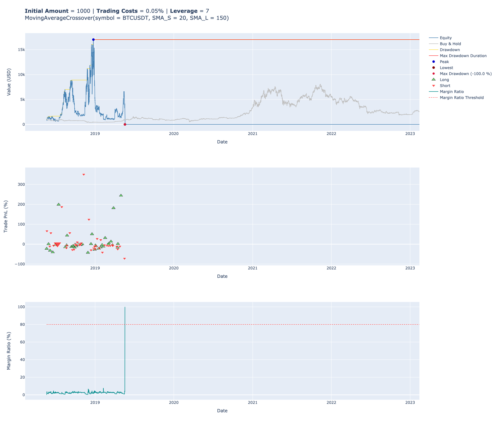
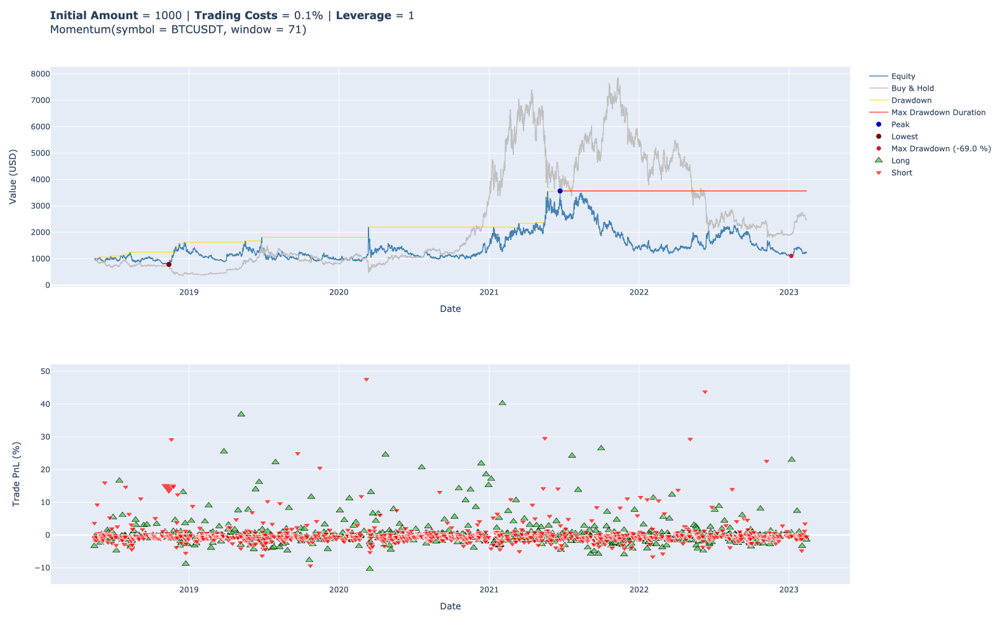

# Stratestic  📈📊🛠️

[](https://codecov.io/gh/diogomatoschaves/stratestic)

[](https://badge.fury.io/py/stratestic)


The `stratestic` module is a Python package for backtesting, analysing and optimizing trading strategies. 
It includes pre-implemented strategies, but it is also possible to create new strategies or even to combine them.

The basic usage is as simple as importing a backtesting class, a strategy and run the backtest. The backtest can 
then be refined with optimizations or by incorporating leverage.  

Overall it offers a powerful way to explore and experiment with different strategies, 
and to evaluate the performance under different conditions.

## Installation

    $ pip install stratestic

## Usage

1. [ Vectorized Backtesting ](#vectorized-backtesting)
2. [ Iterative Backtesting ](#iterative-backtesting)
3. [ Backtesting with leverage and margin ](#leverage) <br>
    3.1. [ Calculating the maximum allowed leverage ](#maximum-leverage)
4. [ Optimization ](#optimization)
5. [ Strategies ](#strategies) <br>
    5.1. [ Combined strategies](#combined-strategies) <br>
    5.2. [ Create new strategies](#new-strategies)

<a name="vectorized-backtesting"></a>
### Vectorized Backtesting

The `VectorizedBacktester` is a backtesting class that allows you to test trading strategies
on historical price data. It has the advantage of being faster than the iterative backtesting, but at
a cost of flexibility, as it will be hard or outright not possible to accomplish this for some more 
complex strategies. For all the strategies provided by this library, vectorized backtesting is supported.

Below is an example of how to use it for the `MovingAverageCrossover` strategy:

```python
from stratestic.backtesting import VectorizedBacktester
from stratestic.strategies import MovingAverageCrossover

symbol = "BTCUSDT"
trading_costs = 0.1 # This should be in percentage, i.e. 0.1% 

mov_avg = MovingAverageCrossover(50, 200)

vect = VectorizedBacktester(  # Initializes the VectorizedBacktester class with the strategy.
    mov_avg,
    symbol,
    amount=1000,
    trading_costs=trading_costs
)
vect.load_data()  # Load the default sample data. You can pass your own DataFrame to 'load_data'
vect.run()  # Runs the backtest and shows the results
```

This will output the results in textual and graphical form.

```
************************************************************
                    BACKTESTING RESULTS                     
************************************************************
                          Overview                          
------------------------------------------------------------
Total Duration                          4 years and 38 weeks
Start Date                               2018-05-23 13:00:00
End Date                                 2023-02-13 01:00:00
Trading Costs [%]                                        0.1
Exposure Time [%]                                      100.0
Leverage [x]                                               1
Equity - Initial [USDT]                                 1000
Equity - Final [USDT]                                3215.96
Equity - Peak [USDT]                                 5356.87
------------------------------------------------------------
                          Returns                           
------------------------------------------------------------
Total Return [%]                                       221.6
Annualized Return [%]                                  21.49
Annualized Volatility [%]                              73.95
Buy & Hold Return [%]                                 175.98
------------------------------------------------------------
                         Drawdowns                          
------------------------------------------------------------
Max Drawdown [%]                                      -61.18
Avg Drawdown [%]                                        -8.2
Max Drawdown Duration                    1 year and 38 weeks
Avg Drawdown Duration                     3 weeks and 2 days
------------------------------------------------------------
                           Trades                           
------------------------------------------------------------
Total Trades                                             267
Win Rate [%]                                           32.21
Best Trade [%]                                         87.77
Worst Trade [%]                                       -21.11
Avg Trade [%]                                           0.44
Max Trade Duration                        5 weeks and 3 days
Avg Trade Duration                       6 days and 11 hours
Expectancy [%]                                           5.9
------------------------------------------------------------
                           Ratios                           
------------------------------------------------------------
Sharpe Ratio                                            0.33
Sortino Ratio                                           0.28
Calmar Ratio                                            0.35
Profit Factor                                            1.0
System Quality Number                                  -0.02
------------------------------------------------------------
************************************************************
```

<p align="left">
  
</p>

<a name="iterative-backtesting"></a>
### Iterative Backtesting

The `IterativeBacktester` is a backtesting class that allows you to test trading strategies
on historical price data. It works by iterating through each historical data point and simulating
trades based on your strategy. This feature allows for a greater degree of flexibility, 
allowing you to add more complex logic to the strategies. Below is an example of how you would use this 
class to backtest the `MovingAverageConvergenceDivergence` strategy. 

```python
from stratestic.backtesting import IterativeBacktester
from stratestic.strategies import MovingAverageConvergenceDivergence

symbol = "BTCUSDT"

macd = MovingAverageConvergenceDivergence(26, 12, 9)

ite = IterativeBacktester(macd, symbol=symbol) # Initializes the IterativeBacktester class with the strategy
ite.load_data() # Load the default sample data. You can pass your own DataFrame to load_data
ite.run() # Runs the backtest and shows the results
```
This will output the results in textual and graphical form.

```
************************************************************
                    BACKTESTING RESULTS                     
************************************************************
                          Overview                          
------------------------------------------------------------
Total Duration                          4 years and 39 weeks
Start Date                               2018-05-16 15:00:00
End Date                                 2023-02-13 01:00:00
Trading Costs [%]                                        0.0
Exposure Time [%]                                      100.0
Leverage [x]                                               1
Equity - Initial [USDT]                                 1000
Equity - Final [USDT]                               17145.68
Equity - Peak [USDT]                                29566.42
------------------------------------------------------------
                          Returns                           
------------------------------------------------------------
Total Return [%]                                     1614.57
Annualized Return [%]                                  60.58
Annualized Volatility [%]                              70.99
Buy & Hold Return [%]                                 163.16
------------------------------------------------------------
                         Drawdowns                          
------------------------------------------------------------
Max Drawdown [%]                                      -56.09
Avg Drawdown [%]                                       -5.46
Max Drawdown Duration                    1 year and 22 weeks
Avg Drawdown Duration                       1 week and 1 day
------------------------------------------------------------
                           Trades                           
------------------------------------------------------------
Total Trades                                            3136
Win Rate [%]                                           34.92
Best Trade [%]                                         45.61
Worst Trade [%]                                       -12.84
Avg Trade [%]                                           0.09
Max Trade Duration                       2 days and 14 hours
Avg Trade Duration                   13 hours and 15 minutes
Expectancy [%]                                          1.72
------------------------------------------------------------
                           Ratios                           
------------------------------------------------------------
Sharpe Ratio                                            0.84
Sortino Ratio                                            0.8
Calmar Ratio                                            1.08
Profit Factor                                           1.01
System Quality Number                                   0.16
------------------------------------------------------------
************************************************************
```
<p align="left">
  
</p>

<a name="leverage"></a>
### Backtesting with leverage and margin

Both the Vectorized and Iterative backtesting classes provide users with the ability to incorporate leverage into a 
backtest and visualize the margin ratio evolution during the backtest. This feature enables users to identify 
instances where a margin call would occur, leading to a potential loss of all funds. The calculations follow the 
rules outlined by Binance, as detailed [here](https://www.binance.com/en/support/faq/how-to-calculate-liquidation-price-of-usd%E2%93%A2-m-futures-contracts-b3c689c1f50a44cabb3a84e663b81d93) and [here](https://www.binance.com/en/support/faq/leverage-and-margin-of-usd%E2%93%A2-m-futures-360033162192). 
It's important to note that these calculations assume the selected margin is _Isolated_, and the position mode
is _One Way_. Below an example is shown:

```python
from stratestic.backtesting import VectorizedBacktester
from stratestic.strategies import MovingAverageCrossover

symbol = "BTCUSDT"
trading_costs = 0.05

mov_avg = MovingAverageCrossover(20, 150)

vect = VectorizedBacktester(
    mov_avg,
    symbol,
    amount=1000,
    trading_costs=trading_costs,
    leverage=7  # Pass the desired leverage here
)

vect.load_data()
vect.run()
```

This will output the following results and plot:

```
************************************************************
                    BACKTESTING RESULTS                     
************************************************************
                          Overview                          
------------------------------------------------------------
Total Duration                          4 years and 38 weeks
Start Date                               2018-05-21 11:00:00
End Date                                 2023-02-13 01:00:00
Trading Costs [%]                                       0.05
Exposure Time [%]                                      100.0
Leverage [x]                                               7
Equity - Initial [USDT]                                 1000
Equity - Final [USDT]                                    0.0
Equity - Peak [USDT]                                17012.48
------------------------------------------------------------
                          Returns                           
------------------------------------------------------------
Total Return [%]                                      -100.0
Annualized Return [%]                                 -100.0
Annualized Volatility [%]                             144.81
Buy & Hold Return [%]                                 157.53
------------------------------------------------------------
                         Drawdowns                          
------------------------------------------------------------
Max Drawdown [%]                                      -100.0
Avg Drawdown [%]                                      -15.65
Max Drawdown Duration                    4 years and 7 weeks
Avg Drawdown Duration                    4 weeks and 7 hours
------------------------------------------------------------
                           Trades                           
------------------------------------------------------------
Total Trades                                              82
Win Rate [%]                                           28.05
Best Trade [%]                                        350.39
Worst Trade [%]                                       -71.82
Avg Trade [%]                                            0.3
Max Trade Duration                        2 weeks and 5 days
Avg Trade Duration                       4 days and 10 hours
Expectancy [%]                                         26.08
------------------------------------------------------------
                           Ratios                           
------------------------------------------------------------
Sharpe Ratio                                             0.2
Sortino Ratio                                          -0.45
Calmar Ratio                                            -1.0
Profit Factor                                           0.86
System Quality Number                                  -0.38
------------------------------------------------------------
************************************************************
```
<p align="left">
  
</p>

As evident from the results, employing a leverage of `7` led to a margin call during the backtest, 
showing that this particular strategy would have implied a total loss of the funds, unless more margin was
added to the positions in the meantime. 

<a name="maximum-leverage"></a>
#### Calculating the maximum allowed leverage

The backtesting class also offers an API to determine the maximum permissible leverage for a backtest, 
ensuring that the margin ratio remains below a specified threshold. This can be accomplished by following the 
steps outlined in the following example.

```python
from stratestic.backtesting import VectorizedBacktester
from stratestic.strategies import MovingAverageCrossover

symbol = "BTCUSDT"
trading_costs = 0.05

mov_avg = MovingAverageCrossover(20, 50)

vect = VectorizedBacktester(
    mov_avg,
    symbol,
    amount=10000,
    trading_costs=trading_costs,
)

vect.load_data()
vect.maximum_leverage(margin_threshold=0.8)  # The margin threshold will be the maximum margin_ratio allowed during the 
                                             # backtest. If omitted, then the default value of 0.8 is used. Must be 
#                                            # between 0 and 1.
```

Which will output the maximum leverage without a margin call. In the example above, the result would be:

```shell
Out[2]: 5
```

<a name="optimization"></a>
### Optimization

You can use the optimization API of either the iterative or vectorized backtester in order to find the best combination 
of parameters for a backtest. Below is an example of how to achive this.

```python
from stratestic.backtesting import IterativeBacktester
from stratestic.strategies import Momentum

symbol = "BTCUSDT"
trading_costs = 0.1

mom = Momentum(30) # Initialize the strategy object with any values. 

ite = IterativeBacktester(mom, symbol=symbol, trading_costs=trading_costs) # It could also have been the
                                                                             # IterativeBacktester class

ite.load_data() # Load the default sample data. You can pass your own DataFrame to load_data

ite.optimize(dict(window=(40, 90))) # Pass as an argument a dictionary with the parameters as keywords and 
                                     # with a tuple with the limits to test as the value. In this case we are
                                     # testing the strategy with the parameter 'window' between the values of
                                     # 40 and 90

```

This will output the best parameters and show the corresponding results.

<p align="left">
  
</p>


<a name="strategies"></a>
### Strategies

<a name="combined-strategies"></a>
#### Combined strategies

It is possible to combine 2 or more strategies into one, by means of the `StrategyCombiner` class. The options
for combining the strategies are `Unanimous` or `Majority`. The `Unaninmous` option signals a buy or a sell
if all the individual strategy signals agree (unanimous), whereas the `Majority` method provides a buy a 
or sell signal if the majority of the individual strategy signals points in one direction. 

Here's an example of how that could be achieved:

```python
from stratestic.backtesting import VectorizedBacktester
from stratestic.strategies import MovingAverageCrossover, Momentum, BollingerBands
from stratestic.backtesting.combining import StrategyCombiner

symbol = "BTCUSDT"
trading_costs = 0.1

mov_avg = MovingAverageCrossover(30, 200)
momentum = Momentum(70)
boll_bands = BollingerBands(20, 2)

# The strategies are passed on to StrategyCombiner as list.
combined = StrategyCombiner([mov_avg, momentum, boll_bands], method='Unanimous')

vect = VectorizedBacktester(combined, symbol, amount=1000, trading_costs=trading_costs)
vect.load_data() # Load the default sample data. You can pass your own DataFrame to 'load_data'

vect.run()
```

This strategy combiner class can also be optimized using the same API, with the difference that the 
optimization parameters have to be passed in an array. See the next example:

```python
from stratestic.backtesting import VectorizedBacktester
from stratestic.strategies import MovingAverageCrossover, Momentum
from stratestic.backtesting.combining import StrategyCombiner

symbol = "BTCUSDT"
trading_costs = 0.1

mov_avg = MovingAverageCrossover(30, 200)
momentum = Momentum(70)

# The strategies are passed on to StrategyCombiner as list.
combined = StrategyCombiner([mov_avg, momentum], method='Majority')

vect = VectorizedBacktester(combined, symbol, amount=1000, trading_costs=trading_costs)
vect.load_data() # Load the default sample data. You can pass your own DataFrame to 'load_data'

# The optimization parameters are passed as an array of dictionaries containing the 
# parameter intervals and steps for each individual strategy.
vect.optimize([dict(sma_s=(20, 40), sma_l=(100, 200)), dict(window=(60, 80))])
```

<a name="new-strategies"></a>
#### Create new strategies

This module comes with some default strategies ready to be used, but chances are you will want
to expand this and create your own strategies. This can be easily achieved by using the template class below, 
which inherits the `StrategyMixin` class:

```python
from collections import OrderedDict
from stratestic.strategies._mixin import StrategyMixin


class MyStrategy(StrategyMixin):
    """
    Description of my strategy

    Parameters
    ----------
    parameter1 : type
        Description of parameter1.
    parameter2 : type, optional
        Description of parameter2, by default default_value.

    Attributes
    ----------
    params : OrderedDict
        Parameters for the strategy, by default {"parameter1": lambda x: x}

    Methods
    -------
    __init__(self, parameter1, parameter2=default_value, **kwargs)
        Initializes the strategy object.
    update_data(self)
        Retrieves and prepares the data.
    calculate_positions(self, data)
        Calculates positions based on strategy rules.
    get_signal(self, row=None)
        Returns signal based on current data.
    """

    def __init__(
        self, 
        parameter1: <type>,
        parameter2: <type> = <some_default_value>,
        data=None,
        **kwargs
    ):
        """
        Initializes the strategy object.

        Parameters
        ----------
        parameter1 : type
            Description of parameter1.
        parameter2 : type, optional
            Description of parameter2, by default default_value.
        data : pd.DataFrame, optional
            Dataframe of OHLCV data, by default None.
        **kwargs : dict, optional
            Additional keyword arguments to be passed to parent class, by default None.
        """
        self._parameter1 = parameter1  # Each specific parameter that you want to add to the strategy
                                       # must be initalized in this manner, with a _ followed by the name 
                                       # of the parameter
        self._parameter2 = parameter2

        self.params = OrderedDict(
            parameter1=lambda x: <type>(x),
            parameter2=lambda x: <type>(x)
        ) 

        StrategyMixin.__init__(self, data, **kwargs)

    def update_data(self, data):
        """
        Updates the input data with additional columns required for the strategy.

        Parameters
        ----------
        data : pd.DataFrame
            OHLCV data to be updated.

        Returns
        -------
        pd.DataFrame
            Updated OHLCV data containing additional columns.
        """
        super().update_data(data)

        # Code to update data goes here. Check the given strategies for an example.
        
        return data

    def calculate_positions(self, data):
        """
        Calculates positions based on strategy rules.

        Parameters
        ----------
        data : pd.DataFrame
            OHLCV data.

        Returns
        -------
        pd.DataFrame
            OHLCV data with additional 'position' column containing -1 for short, 1 for long.
        """
        data["side"] =  # Code to calculate side goes here

        return data

    def get_signal(self, row=None):
        """
        Returns signal based on current data.

        Parameters
        ----------
        row : pd.Series, optional
            Row of OHLCV data to generate signal for, by default None.

        Returns
        -------
        int
            Signal (-1 for short, 1 for long, 0 for neutral).
        """
        # Code to generate signal goes here

        return signal

```

You would replace `MyStrategy` with the name of your strategy, and replace "Description of my strategy"
with a brief explanation of what your strategy does.

`__init__()` is where you initialize your strategy parameters. In the case of our example strategy outlined 
above, `parameter1` and `parameter2` would be replaced with the actual names of your strategy's parameter(s), 
and `<type>` would be replaced with the appropriate data types of your parameters. 
This is very important for appropriate type checking on the frontend.

The `params` attribute is an `OrderedDict` that specifies the default parameters for your strategy. 
The key is the parameter name, and the value is a lambda function that converts the user's input
into the appropriate data type.

Finally, we need to call StrategyMixin.__init__(self, data, **kwargs) in order to initialize the parent class.

`update_data()` should contain code to retrieve and prepare the data for your strategy. This is where you can 
add indicators or manipulate the data and create new columns that will then be used to calculate a signal. 
And example if you were developing a momentum strategy would be to calculate the moving average for the selected window.

`calculate_positions()` should contain code to calculate the positions for your strategy based 
on the current data. This is where you input the logic of your strategy in a vectorized way. For the same example 
of the momentum strategy, here you'd add the logic for getting the signal of when it was a BUY or a SELL.

Note that this may not be possible if your strategy is very complex. In that this method can 
be ignored, and only the IterativeBacktester can be used.

`get_signal()` should contain code to generate the signal for a given row of data. The signal 
should be an integer, where -1 represents a short position, 1 represents a long position, 
and 0 represents a neutral position.

**In any case it is highly recommended to check the existing [strategies](https://github.com/diogomatoschaves/stratestic/tree/main/stratestic/strategies) to get a better 
idea of how to implement these methods.**
